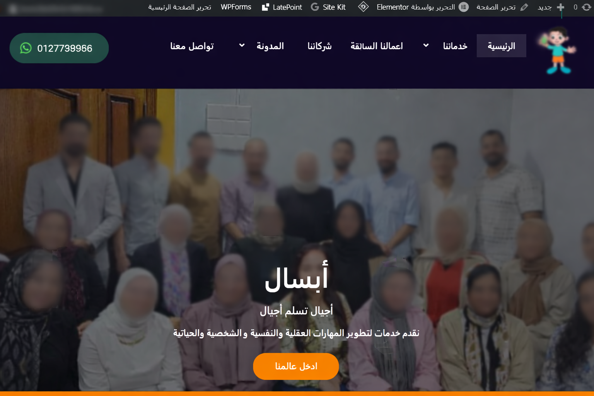
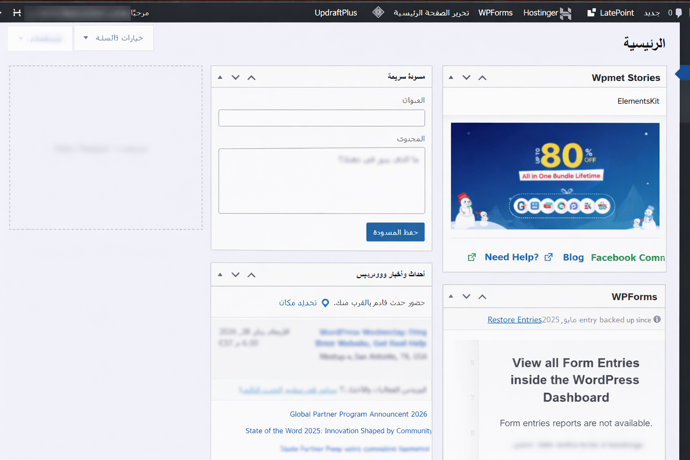
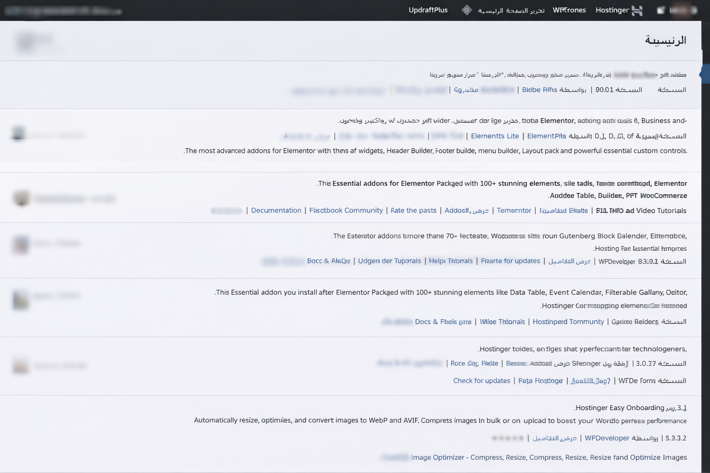
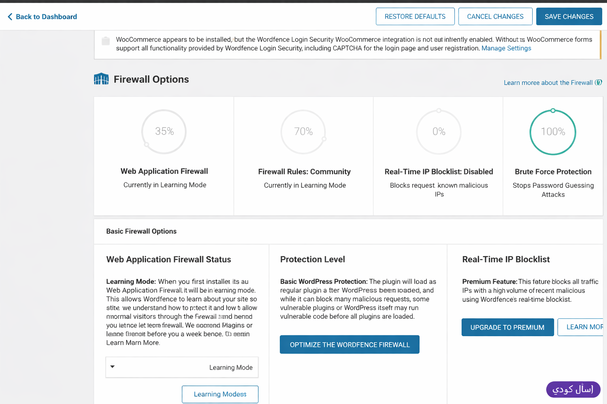

# Secure WordPress Client Project (GRC & SOC Focused)

## Overview
This repository contains a **sanitized production WordPress website** developed for an educational client.  
The project is shared with **explicit client approval** for portfolio purposes and demonstrates **secure configuration management, risk-aware decision-making, and SOC-aligned operational security practices**.

This is a **real production system**, not a tutorial or demo, intentionally prepared for **public review without exposing sensitive data**.

---

## System Scope
- Public-facing educational website
- Administrative backend (WordPress)
- Plugin-driven architecture
- Hosted on shared infrastructure (Hostinger)

---

## Tech Stack
- **WordPress** (PHP, MySQL)
- **Elementor / Templately**
- **WooCommerce**
- **WPForms**
- **LatePoint Scheduling**
- **Hostinger (LiteSpeed stack)**
- **Wordfence Security**
- Apache (`.htaccess`)

---

## Governance, Risk & Compliance (GRC)

This project applies multiple **GRC-aligned controls**:

### Configuration Governance
- Production secrets intentionally excluded (`wp-config.php` not committed)
- Safe reference configuration retained (`wp-config-sample.php`)
- Environment-specific artifacts removed prior to publication

### Risk Management
- Plugin audit conducted; unused and redundant plugins removed
- Backup archives, cache data, and upgrade artifacts excluded
- Public exposure risk evaluated before repository publication

### Data Protection & Privacy
- No credentials, API keys, or secrets included
- No personally identifiable information (PII)
- Media and screenshots sanitized (faces, emails, identifiers blurred)
- Repository safe for public access and code review

### Change & Asset Control
- Clear separation between application code and hosting artifacts
- Sanitized application state versioned intentionally
- No modification to WordPress core files (`wp-admin`, `wp-includes`)

---

## Security Operations (SOC-Relevant Practices)

This project demonstrates **hands-on SOC-aligned security operations**:

### Web Application Firewall (WAF)
- **Wordfence Web Application Firewall deployed**
- Initial deployment in **Learning Mode** to reduce false positives
- Firewall optimized to load **before WordPress execution**
- Community firewall rules applied
- Brute-force protection enabled (100%)

### Authentication & Access Control
- Brute-force attack mitigation enabled
- CAPTCHA enforced on authentication flows
- Admin access restricted and monitored
- XML-RPC evaluated and restricted where unnecessary

### Operational Security Mindset
- Controls deployed gradually (observe → enforce)
- Availability preserved while security baselines established
- Hosting-level protections acknowledged (SSL, firewall, malware scanning)

---

## Repository Structure
secure-wordpress-client-project/
├── wordpress-site/
│ ├── wp-admin/
│ ├── wp-content/
│ │ ├── languages/
│ │ ├── mu-plugins/
│ │ ├── plugins/
│ │ └── themes/
│ ├── wp-includes/
│ ├── wp-config-sample.php
│ ├── .htaccess
│ └── index.php
├── screenshots/
└── README.md

---

## Screenshots (Sanitized)

### Public Website (Faces Blurred for Privacy)

### WordPress Administrative Dashboard

### Plugin Governance & Management

### Security Controls – Web Application Firewall

> Screenshots were intentionally sanitized to remove personal identifiers,  
> demonstrating privacy-by-design and compliance awareness.

---

## Local Setup (Optional)
This repository is **not intended for production deployment**, but can be reviewed locally:

1. Install WordPress locally (XAMPP / LocalWP)
2. Copy `wordpress-site/` into the web root
3. Rename `wp-config-sample.php` → `wp-config.php`
4. Insert local database credentials
5. Import a test database if required

---

## Live Demo
The live site is **not publicly linked** to reduce risk exposure.

> **Live demo available upon request.**

This decision reflects **risk-based access control** and responsible system handling.

---

## Disclaimer
- Shared strictly for demonstration and portfolio purposes
- Client approval obtained prior to publication
- No production credentials or user data included
- Repository hardened for public visibility

---

## Author Notes
This project highlights **secure system handling, governance awareness, and SOC-level operational discipline**, relevant to:

- Governance, Risk & Compliance (GRC)
- SOC / Security Operations
- Cybersecurity Analyst roles

